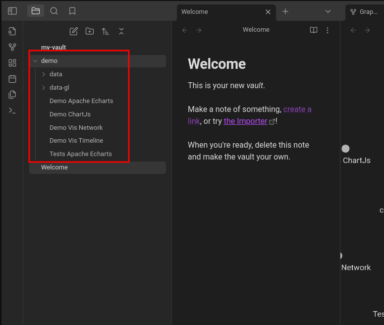
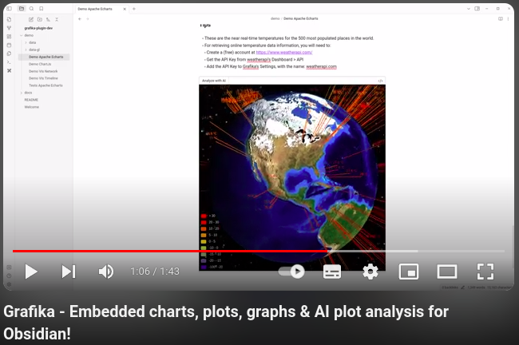

# Grafika


> [!WARNING]
> This plugin is still at an **experimental** **Proof-of-Concept (POC)** stage.
> Even though this plugin is stable enough to try and use, _performance_ 
> and _usability_ are still **WIP**.

This is an **Obsidian plugin** for rendering **graph, chart and plot visualizations** embedded into **Obsidian's Markdown notes**.

## Features

- **Create** Markdown notes with **embedded visualizations** of different kinds.
- **Build & Share Dashboards** with **interactive** and **live** charts, graphs and plots.
- **OpenAI's Analysis**
	- Get **AI Insights** for a plot just by **clicking a button!**
	- **Customize** the analysis by configuring your own **System** and **User prompts**
		
> [!IMPORTANT]
> **OpenAI Analysis** feature requires:
> - An **OpenAI account** and **API Key**.
> -  Access to **gpt-4-turbo model** via **OpenAI's API**

#### Visualization Libraries

**Write JavaScript code fence blocks** for rendering visualizations with different libraries:
- [Apache ECharts](https://echarts.apache.org/en/index.html)
- [Chart.js](https://www.chartjs.org/)
- [visjs](https://visjs.org/) (network and timeline graphs **only**!)

#### Adapt & Reuse Examples

There are plenty of **code examples** at the websites for the supported [#Visualization Libraries](#Visualization%20Libraries).
Many of them are **easy to adapt** to code fence blocks, saving a considerable **amount of time:** 

1. **Copy-and-paste example code** directly into a **code fence block**.
2. **Adapt** the example code according to the instructions (**WIP**).
3. **Click outside** the code fence block to see the results.

## Try It!

There are several demos available for downloading and playing around:

- **Animated** & **Interactive** plots
- **Plotting data** from different data sources:
	- **Online** sources, like **HTTP REST endpoints**
	- **Markdown tables**
	- Local **CSV** & **JSON** data files

### Setup

1. [Install Grafika](#How%20to%20Install)
2. **Download** the zipped demo files: [demo-__RELEASE_VERSION__.zip](https://github.com/anteloc/obsidian-grafika-plugin/releases/download/__RELEASE_VERSION__/demo-__RELEASE_VERSION__.zip)
3. **Uncompress** it into your vault




> [!NOTE]
> - Data files are located under the **data** and **data-gl** folders. 
> - Files in JSON, CSV and other formats will **not show** on Obsidian's File Explorer.
> - Access those files by **right-clicking on data or data-gl folder > Show in system explorer **


### Showcase

Have a look at the following **video** and **screenshots** in order to get a feeling of the possibilities!
#### Video

A short video showing:

- **Animated** and **interactive** visualizations
- Some of the required **JavaScript code** to create them
- And also how **AI Plot Analysis** works


[](https://www.youtube.com/watch?v=PrKL0OJKThg "Grafika Demo Video")

#### Screenshots

- [Markdown table data plot](docs/assets/images/demo-table-plot.png)
- [File data plot](docs/assets/images/demo-csv-plot.png)
- [Interactive Earth 3D showing real-time weather data](docs/assets/images/demo-3d-globe-weather.png)
- [Interactive force graph](docs/assets/images/demo-force-graph.png)

## How to Install

There are currently two supported methods for installing this plugin:

### Method 1 - BRAT (Recommended)

1. Install **BRAT Plugin** from the **Community Plugins** in Obsidian

2. In **Obsidian's Settings**
	1. **BRAT > Add Beta Plugin > Github repository for...** 
	2. Set to: https://github.com/anteloc/obsidian-grafika-plugin
	3. Restart **Obsidian**


### Method 2 - Manual install 

- **Requirements**: 
	- Node.js **v20.x**

1. In **Obsidian**, create a new vault with name: `my-vault` 


2. **If it doesn't exist**, create a new `plugins` folder under your vault's `.obsidian` folder. 
	- On some systems, this `.obsidian` folder will be **hidden**.


3. Open a terminal and `cd` to the **plugins** folder for your vault:

**MacOS and Linux**
```shell
cd path/to/Documents/Obsidian/my-vault/.obsidian/plugins
```

**Windows**
```shell
cd path\to\Documents\Obsidian\my-vault\.obsidian\plugins
```

4. Clone and build **Grafika's repository**:
```shell
git clone https://github.com/anteloc/obsidian-grafika-plugin.git
cd obsidian-grafika-plugin
npm install
```

5. Open your `my-vault` in **Obsidian** and [Turn on community plugins](https://help.obsidian.md/Extending+Obsidian/Community+plugins#Browse+community+plugins) if required.

6. In **Obsidian's Settings**, enable **Grafika** if required and **restart Obsidian** afterwards:


## Support

If you are currently enjoying this plugin, and maybe has saved you **time and effort** worth inviting me a coffee, consider **supporting** my work by **buying me one**!

[](https://www.buymeacoffee.com/anteloc)


