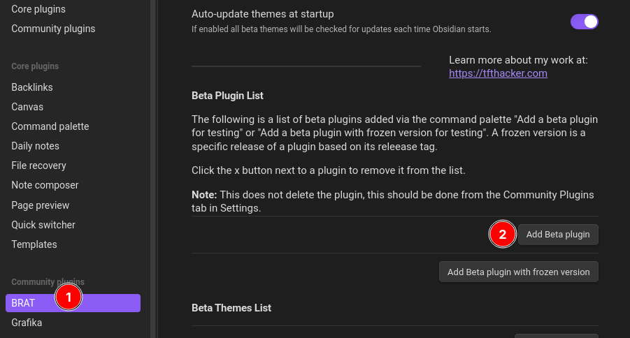
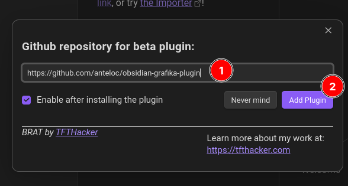
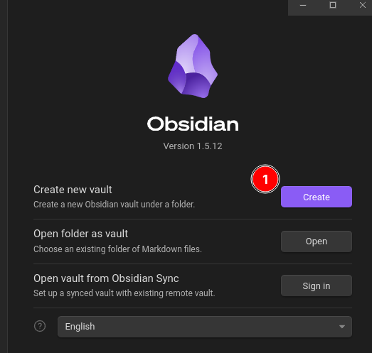
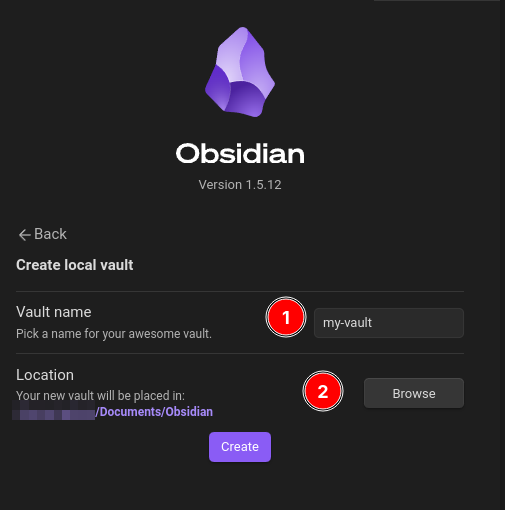
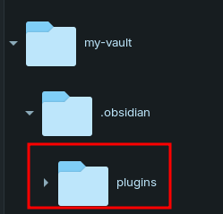
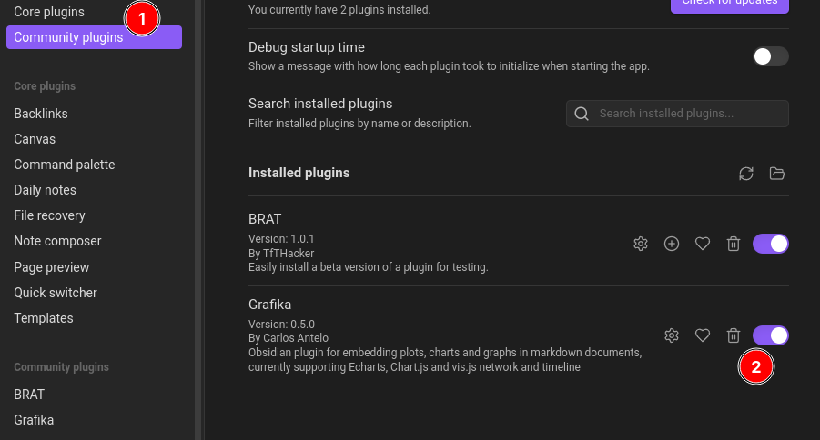

# Grafika


> [!warning] Warning
> This plugin is still at an **experimental** **Proof-of-Concept (POC)** stage.
> Even though this plugin is stable enough to try and use, performance 
> and usability are still **WIP**.

This is an **Obsidian plugin** for rendering graphs, charts and plots embedded into **Obsidian's Markdown notes**.

- **Write Markdown**  with some **JavaScript code fence blocks** inside: they will be rendered as **graphs, charts and plots.** 
- **AI Analysis:** 
	- **AI insights** for a plot just by clicking on a button!
	- **Customize** the analysis by configuring your own **System** and **User prompts**
	- **NOTES**: 
		- You will need an **OpenAI account** and **API Key** for AI Analysis to work.
		- Only **gpt-4-turbo model** is currently supported.
- **Create dashboards in Markdown**, with embedded charts, graphs and plots.
- **Share your dashboards**: you only need to share some Markdown files with some embedded JavaScript inside!

It currently supports creating charts, graphs and plots with the following libraries:
- [Apache echarts](https://echarts.apache.org/en/index.html)
- [ChartJs](https://www.chartjs.org/)
- [visjs network and timeline graphs](https://visjs.org/)

I made an effort in order to make it easy adapting the **source code** from those libraries' **plot examples** to work with **very few changes**:

1. **Copy-and-paste** a plot code example directly into a code fence block.
2. **Adapt** the code example according to the instructions (**WIP**).
3. **Click outside** the code fence block to see the results.

## How to Install

There are currently two supported methods for installing this plugin:

### Method 1 - BRAT (Recommended)

1. Install **BRAT Plugin** from the **Community Plugins** in Obsidian

2. In **Obsidian's Settings**, add **Grafika's Github repository URL** 
	`https://github.com/anteloc/obsidian-grafika-plugin` 
	to **BRAT's Beta Plugin List**:





3. Restart **Obsidian**

### Method 2 - Manual install 

- **Requirements**: 
	- nodejs **v20.x**

1. In **Obsidian**, create a new vault with name: `my-vault` 





2. **If it doesn't exist**, create a new `plugins` folder under your vault's `.obsidian` folder. On some systems, this `.obsidian` folder will be **hidden**.



3. Open a terminal and `cd` to the **plugins** folder for your vault:

**MacOS and Linux**
```shell
cd path/to/Documents/Obsidian/my-vault/.obsidian/plugins
```

**Windows**
```shell
cd path\to\Documents\Obsidian\my-vault\.obsidian\plugins
```

4. Clone and build **Grafika's repository**:
```shell
git clone https://github.com/anteloc/obsidian-grafika-plugin.git
cd obsidian-grafika-plugin
npm install
```

4. Open your `my-vault` in **Obsidian** and [Turn on community plugins](https://help.obsidian.md/Extending+Obsidian/Community+plugins#Browse+community+plugins) if required.

5. In **Obsidian's Settings**, enable **Grafika** if required and **restart Obsidian** afterwards:




# Usage

### WIP

1. Manually install Grafika on Obsidian - TODO Add instructions
2. Download the `demo` folder and copy it inside your vault
3. Open the Demo XXX.md files
4. Experiment with the charts and plots by editing the JavaScript code fences to see the results

## Support

If you think this plugin saved you **time and effort** worth inviting me a coffee,  **support** my work by buying me one!
[](https://www.buymeacoffee.com/anteloc)


